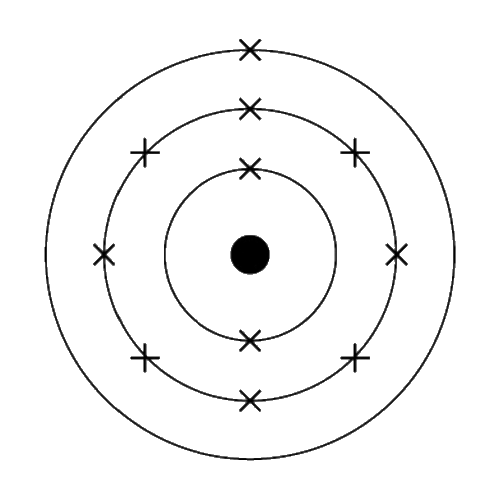

# Lesson 1.9 - Electron Structure

## Fitting into shells

Electrons will always fill the inner-most shells first.

This means that they will go into the first shell before the second.

In other words, the electrons occupy the lowest available energy levels (innermost available shells).

## Electron configuration

We can represent electrons in an atom using a series of numbers.

The electronic configuration of *sodium* is:

> 2,8,1

representing 2 electrons in the first shell, 8 in the second shell, and 1 in the third shell.

## Electron diagrams

We can represent electrons in an atom using a diagram.

Sodium is represented as follows:

{width=200, height=200}

with 2 in the first shell (energy level), 8 in the second, and 1 in the third.

## Shell limits

Electron shells have a maximum number of electrons they can hold.

The table below shows the number of electrons each shell holds (counting from the inside).

| Shell  | Limit |
| ------ | ----- |
| 1      | 2     |
| 2      | 8     |
| 3      | 8     |

Note: you mostly only need to know about the first 3 shells.  
After that, it gets a bit more complicated (so we don't do it at GCSE).
