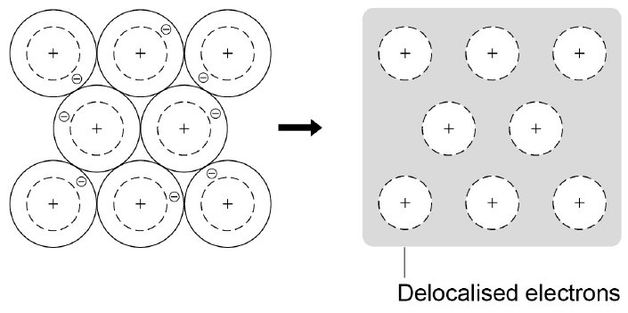

# Lesson 3.5 - Metallic Bonding

## Metallic compounds

Metallic compounds (sometimes simply referred to as 'metals') are giant structures.

They are made up of atoms arranged in a regular pattern.

## Formation

Metallic bonds are formed when electrons are **delocalised**.

These delocalised electrons are shared throughout the structure.

## Properties

Most metals have the following properties:

* High melting point
* High boiling point
* Stronger when made into an alloy
* Can be bent (malleable)
* Arranged in layers

## Representing metallic bonding

We can represent metallic bonding using the image below.

Image source: [AQA](https://aqa.org.uk).
